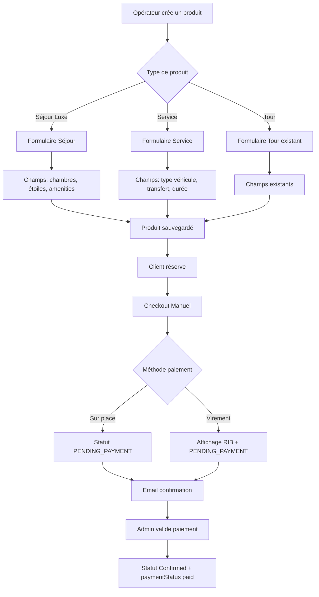

# MISSION 0 : AUDIT GLOBAL, SYNCHRONISATION ET PLAN D'ACTION

**Date :** 21 Mai 2026  
**Auteur :** Lead Dev Overglow (Roo)  
**Statut :** Audit complété - En attente de validation  

---

## 📋 TÂCHE 1 : SCAN DE L'ENVIRONNEMENT

### Architecture Globale

Le projet Overglow V1 est une **plateforme de réservation de tours et activités de luxe au Maroc** avec une architecture monorepo :

```
overglow-V1/
├── server.js                    # Entry point Express
├── backend/
│   ├── models/                  # 19 modèles Mongoose
│   ├── controllers/             # 27 contrôleurs
│   ├── routes/                  # 28 routes API
│   ├── middleware/              # 7 middlewares
│   ├── services/                # 2 services (email, payment)
│   └── utils/                   # 14 utilitaires
├── frontend/
│   └── src/
│       ├── pages/               # 45 pages React
│       ├── components/          # 53 composants
│       ├── context/             # AuthContext, CurrencyContext, ToastContext
│       ├── hooks/               # useFormValidation, useAnalytics
│       └── config/              # axios centralisé
├── docs/                        # Documentation complète
└── plans/                       # Plans historisés (ce dossier)
```

### Stack Technique Confirmée

| Couche | Technologie | État |
|--------|------------|------|
| Backend | Express.js 4.18 + Mongoose 8.0 | ✅ Production |
| Frontend | React 18 + Vite 5 + React Router v6 | ✅ Production |
| UI | Tailwind CSS v3 + Lucide React | ✅ |
| Auth | JWT (access + refresh tokens) | ✅ |
| Paiement | Stripe SDK + PayPal + CMI | ⚠️ Mode mock |
| Upload | Multer + Cloudinary + Sharp | ✅ |
| Email | Nodemailer | ✅ |
| Monitoring | Sentry | ✅ |
| Déploiement | Vercel (serverless) | ✅ |

### Modèles Mongoose Clés Analysés

#### [`Product`](backend/models/productModel.js)
- Champs standards : title, description, category, city, price, duration
- **Séjours Luxe** : `luxuryStay` avec rooms, capacity, amenities (pool/wifi/jacuzzi), standing (1-3 étoiles)
- **Préférence paiement** : `paymentPreference` (virement bancaire / sur place)
- Skip-the-Line, authenticité, badges, métriques, politique d'annulation
- `strict: false` permet des champs dynamiques

#### [`User`](backend/models/userModel.js)
- Rôles : Client, Opérateur, Admin
- Programme fidélité : loyaltyPoints, loyaltyLevel (Bronze/Silver/Gold/Platinum)
- Sécurité : refreshTokens, failedLoginAttempts, lockedUntil

#### [`Booking`](backend/models/bookingModel.js)
- Statuts : Pending, Confirmed, Cancelled
- **Paiement** : paymentStatus (pending/paid/refunded/failed)
- **Méthodes** : stripe, paypal, cmi, cash_pickup, cash_delivery, bank_transfer
- Payout : payoutStatus, payoutDate, payoutEligibleDate

#### [`Operator`](backend/models/operatorModel.js)
- Onboarding multi-étapes : providerType, publicInfo, photos, address, experiences, privateInfo
- Statuts : Pending, Under Review, Active, Suspended, Rejected
- Auto-approbation produits : `autoApproveProducts`
- Badges, métriques, authenticité

#### [`OperatorOnboarding`](backend/models/operatorOnboardingModel.js)
- 6 étapes d'onboarding avec progression
- Informations bancaires : bankInfo (iban, swift, etc.)
- Documents vérifiables

### Système de Paiement Actuel

Le système supporte déjà **6 méthodes de paiement** :

1. **Stripe** - [`paymentController.js`](backend/controllers/paymentController.js:38) : Mode mock avec placeholder keys
2. **PayPal** - [`paymentController.js`](backend/controllers/paymentController.js:78) : Mode mock
3. **CMI** - [`paymentController.js`](backend/controllers/paymentController.js:110) : Placeholder pour cartes marocaines
4. **Cash Pickup** - [`paymentController.js`](backend/controllers/paymentController.js:140) : ✅ Fonctionnel
5. **Cash Delivery** - [`paymentController.js`](backend/controllers/paymentController.js:165) : ✅ Fonctionnel
6. **Bank Transfer** - [`paymentController.js`](backend/controllers/paymentController.js:221) : ✅ RIB affiché

Le [`paymentService.js`](backend/services/paymentService.js) orchestre les paiements avec fallback automatique en mode simulation si les clés API sont manquantes.

### Flux de Réservation Actuel

1. User sélectionne produit → date → créneau → nombre tickets
2. [`CheckoutPage.jsx`](frontend/src/pages/CheckoutPage.jsx) affiche le récapitulatif
3. [`PaymentSelector.jsx`](frontend/src/components/PaymentSelector.jsx) permet de choisir la méthode
4. Appel POST `/api/bookings` avec paymentMethod
5. [`bookingController.js`](backend/controllers/bookingController.js:29) crée la réservation avec statut `Pending`
6. [`processPayment()`](backend/services/paymentService.js:32) orchestre le paiement
7. Si paiement offline (cash/bank) → `paymentStatus: 'pending'`
8. Redirection vers `BookingSuccessPage`

---

## 🔍 TÂCHE 2 : DIAGNOSTIC DE L'EXISTANT

### ✅ Ce Qui Fonctionne Bien

- **Architecture backend solide** : 19 modèles, 27 contrôleurs, 28 routes
- **Système d'authentification complet** : JWT, refresh tokens, sécurité (lock après 5 échecs)
- **CRUD Produits opérationnel** : Création, édition, publication avec auto-approbation conditionnelle
- **Système de réservation fonctionnel** : Avec transactions MongoDB, gestion disponibilité
- **6 méthodes de paiement intégrées** : Dont 3 offline fonctionnelles (cash pickup, cash delivery, bank transfer)
- **Onboarding opérateur 6 étapes** : Complet avec validation
- **Emails transactionnels** : Confirmation booking, notification opérateur
- **Programme fidélité** : Points, niveaux, historique
- **Système de reviews** : Avec modération admin
- **Déploiement Vercel** : Backend + frontend fonctionnels

### ⚠️ Points d'Attention

#### CRUD Opérateur
- **État :** Formulaire d'onboarding complet mais **pas de support explicite pour les "Séjours Luxe" et "Services"** dans le wizard
- Le modèle Product a déjà `luxuryStay` mais le formulaire opérateur ([`OperatorProductFormPage.jsx`](frontend/src/pages/OperatorProductFormPage.jsx)) ne l'exploite pas pleinement
- Pas de champ `productType` pour distinguer Tours / Séjours / Services

#### Circuit Multi-Villes / Panier
- **Pas de page circuit dédiée trouvée** dans le codebase actuel
- Pas de `app/[locale]/circuit/page.tsx` (l'architecture est React Router, pas Next.js App Router)
- Le flux actuel est : Produit unique → Checkout → Booking
- **Pas de panier multi-produits** : Chaque réservation est unitaire

#### Paiement
- Stripe/PayPal/CMI en **mode mock** (placeholder keys)
- Le virement bancaire affiche un RIB fictif
- Pas de statut `PENDING_PAYMENT` explicite dans le modèle Booking (utilisé `Pending` + `paymentStatus: 'pending'`)

### 📊 Niveau d'Avancement Global

| Module | Avancement | Notes |
|--------|-----------|-------|
| Auth & Sécurité | 100% | Production ready |
| CRUD Produits | 90% | Manque support Séjours/Services |
| CRUD Opérateur | 85% | Onboarding complet, manque types produits |
| Réservation | 90% | Fonctionnel, unitaire uniquement |
| Paiement Offline | 80% | Cash/Bank fonctionnels, RIB à personnaliser |
| Paiement Online | 30% | Mode mock uniquement |
| Circuit Multi-villes | 0% | Pas implémenté |
| Panier | 0% | Pas implémenté |
| i18n | 50% | i18next configuré, pas de fallback MongoDB |
| Notifications | 60% | Modèle + service, manque UI complète |
| Withdrawals | 60% | Modèle + contrôleur, manque UI |

---

## 🎯 TÂCHE 3 : PLAN D'ATTAQUE - SURVIVAL BOOST

### Objectif
**Pouvoir encaisser via le circuit sans Stripe** en implémentant :
1. Le support des "Séjours Luxe" et "Services" dans le formulaire opérateur
2. Le "Checkout Manuel" avec paiement sur place ou virement bancaire (RIB)
3. Le statut `PENDING_PAYMENT` pour les commandes en attente

### Architecture Technique Proposée



### Plan Détaillé

#### PHASE 1 : Compléter le Formulaire Opérateur (Séjours & Services)

**Fichiers à modifier :**
- [`backend/models/productModel.js`](backend/models/productModel.js) - Ajouter `productType` enum
- [`frontend/src/pages/OperatorProductFormPage.jsx`](frontend/src/pages/OperatorProductFormPage.jsx) - UI conditionnelle

**Actions :**
1. Ajouter `productType` au modèle Product : `enum: ['tour', 'luxury_stay', 'service']`
2. Étendre `luxuryStay` avec : `starRating` (1-5), `roomTypes` array, `mealPlan`
3. Ajouter `serviceDetails` pour les services : `vehicleType`, `transferFrom`, `transferTo`, `passengers`
4. Modifier le formulaire opérateur avec sélection du type et champs conditionnels
5. Ajouter les icônes Lucide appropriées (Hotel, Car, MapPin)

#### PHASE 2 : Checkout Manuel (Paiement Sans Stripe)

**Fichiers à modifier :**
- [`backend/models/bookingModel.js`](backend/models/bookingModel.js) - Ajouter statut `PENDING_PAYMENT`
- [`backend/controllers/bookingController.js`](backend/controllers/bookingController.js) - Logique checkout manuel
- [`backend/controllers/paymentController.js`](backend/controllers/paymentController.js) - RIB dynamique
- [`frontend/src/components/PaymentSelector.jsx`](frontend/src/components/PaymentSelector.jsx) - UX améliorée
- [`frontend/src/pages/CheckoutPage.jsx`](frontend/src/pages/CheckoutPage.jsx) - Flux manuel

**Actions :**
1. Ajouter `PENDING_PAYMENT` au enum status de Booking
2. Créer endpoint POST `/api/bookings/manual-checkout` :
   - Crée booking avec `status: 'PENDING_PAYMENT'`
   - `paymentStatus: 'pending'`
   - Génère référence unique de paiement
3. Améliorer le RIB dans `getBankDetails()` :
   - Récupérer depuis Settings ou env vars
   - Inclure référence de paiement dans le motif
4. UX PaymentSelector :
   - Section "Paiement sur place" avec instructions claires
   - Section "Virement bancaire" avec RIB copiable + référence
   - Bouton "J'ai effectué le virement" → notifie admin
5. Email de confirmation avec instructions de paiement

#### PHASE 3 : Validation Admin des Paiements

**Fichiers à créer/modifier :**
- [`backend/controllers/adminController.js`](backend/controllers/adminController.js) - Endpoint validation
- [`frontend/src/pages/AdminDashboardPage.jsx`](frontend/src/pages/AdminDashboardPage.jsx) - Section paiements

**Actions :**
1. Endpoint PUT `/api/admin/bookings/:id/confirm-payment` :
   - Vérifie booking `PENDING_PAYMENT`
   - Passe à `Confirmed` + `paymentStatus: 'paid'`
   - Envoie email de confirmation au client
2. Dashboard admin : Liste des bookings en attente de paiement
3. Actions : Confirmer / Rejeter avec motif

#### PHASE 4 : Circuit Multi-Villes (Optionnel - Phase 2)

**Architecture proposée :**
- Créer un modèle `Circuit` regroupant plusieurs produits
- Page `/circuit` avec sélection multi-produits
- Panier stocké en localStorage + synchronisé en BDD
- Checkout groupé avec un seul paiement

---

### 📅 Ordre d'Exécution Recommandé

| Priorité | Phase | Fichiers Clés | Impact |
|----------|-------|---------------|--------|
| 🔴 P0 | Phase 2 : Checkout Manuel | bookingModel, bookingController, PaymentSelector | **Encaissement immédiat** |
| 🟠 P1 | Phase 1 : Formulaire Séjours/Services | productModel, OperatorProductFormPage | **Catalogue enrichi** |
| 🟡 P2 | Phase 3 : Validation Admin | adminController, AdminDashboard | **Gestion paiements** |
| 🟢 P3 | Phase 4 : Circuit Multi-villes | Nouveau modèle Circuit | **Fonctionnalité avancée** |

### ⚡ Recommandation Stratégique

**Commencer par la Phase 2 (Checkout Manuel)** car :
- Le code existe déjà à 80% (cash_pickup, cash_delivery, bank_transfer)
- Permet d'encaisser immédiatement sans Stripe
- Faible risque technique
- ROI immédiat

Puis enchaîner avec la Phase 1 pour enrichir le catalogue avec les Séjours Luxe et Services.

---

## 📁 Fichiers Critiques Identifiés

### Backend
| Fichier | Rôle | Modification |
|---------|------|-------------|
| [`backend/models/productModel.js`](backend/models/productModel.js) | Schéma produit | Ajouter productType, étendre luxuryStay |
| [`backend/models/bookingModel.js`](backend/models/bookingModel.js) | Schéma booking | Ajouter PENDING_PAYMENT |
| [`backend/controllers/bookingController.js`](backend/controllers/bookingController.js) | Création booking | Endpoint manual-checkout |
| [`backend/controllers/paymentController.js`](backend/controllers/paymentController.js) | Paiements | RIB dynamique |
| [`backend/services/paymentService.js`](backend/services/paymentService.js) | Orchestration | Support offline amélioré |

### Frontend
| Fichier | Rôle | Modification |
|---------|------|-------------|
| [`frontend/src/pages/OperatorProductFormPage.jsx`](frontend/src/pages/OperatorProductFormPage.jsx) | Formulaire produit | UI conditionnelle par type |
| [`frontend/src/pages/CheckoutPage.jsx`](frontend/src/pages/CheckoutPage.jsx) | Checkout | Flux manuel |
| [`frontend/src/components/PaymentSelector.jsx`](frontend/src/components/PaymentSelector.jsx) | Sélection paiement | UX améliorée + RIB |
| [`frontend/src/pages/AdminDashboardPage.jsx`](frontend/src/pages/AdminDashboardPage.jsx) | Dashboard admin | Section paiements |

---

## ✅ Critères de Succès

### Technique
- [ ] Booking créé avec statut `PENDING_PAYMENT` pour paiements offline
- [ ] RIB affiché avec référence unique pour virements
- [ ] Formulaire opérateur supporte Séjours Luxe (chambres, étoiles) et Services
- [ ] Admin peut confirmer/rejeter les paiements en attente
- [ ] Emails transactionnels envoyés à chaque étape

### Business
- [ ] Premier encaissement possible sans Stripe
- [ ] Catalogue enrichi avec Séjours et Services
- [ ] Flux de paiement clair pour les utilisateurs marocains

---

## 📝 Notes Importantes

1. **Architecture actuelle** : Le projet utilise React Router (SPA), pas Next.js App Router comme mentionné dans `.clinerules`. Les références à `app/[locale]/` ne correspondent pas à l'architecture actuelle.

2. **Pas de panier multi-produits** : Le système actuel est unitaire (1 produit = 1 booking). Le circuit multi-villes nécessiterait une refonte significative.

3. **i18n** : i18next est configuré mais les fallbacks MongoDB (fr → ar) ne sont pas implémentés.

4. **Paiements offline existants** : `cash_pickup`, `cash_delivery`, et `bank_transfer` sont déjà partiellement implémentés. Il s'agit de les améliorer, pas de les créer from scratch.

---

**Prochaine étape :** Validation de ce plan par le stakeholder, puis switch en mode Code pour implémentation.
